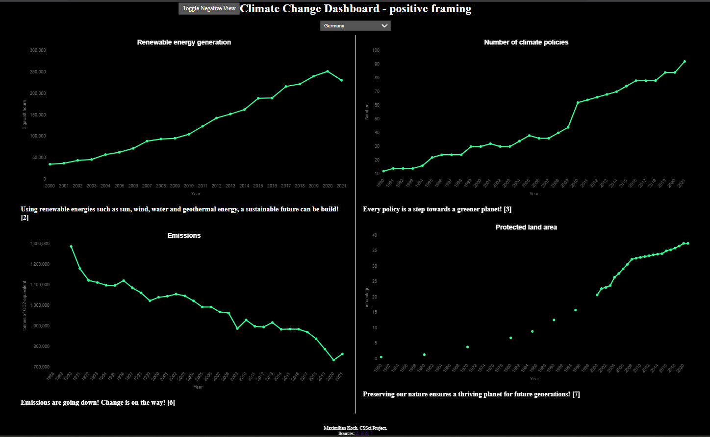
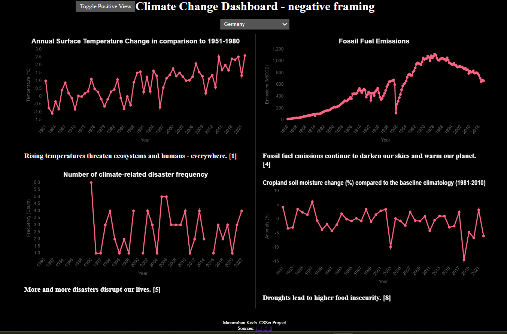

# Climate Change Statistics Dashboard

This website displays various measures of climate change for European countries,
depending on whether the user is looking for a positive
framing or a negative framing.

Data on emissions appear twice here, on purpose:
Once on the negative section, containing the fossil fuel emissions starting
in the 19th century,
and once on the positive section, looking at the more recent developments.
This signifies that the perspective and time frame plays a huge role when looking at issues like climate change!

The `data_preparation.ipynb` notebook summarises all the
different data sources and creates a database (`climate.db`),
which is used by flask with sqlite and chart.js to show the statistics.

This is a preview of the website, here for Germany:

The used statistics are:
1. Annual Surface Temperature Change in comparison to 1951-1980, negative section. [1]
2. Renewable energy generation in Gigawatt hours, positive section. [2]
3. Number of climate policies, positive section. [3]
4. Fossil fuel emissions (Megatonnes of CO2 emissions), negative section. [4]
5. Number of climate-related disaster frequency, negative section. [5]
6. Emissions in tonnes of CO2-equivalent, positive section. [6]
7. Protected land area percentage, positive section. [7]
8. Cropland soil moisture change (%) compared to the baseline climatology (1981-2010), negative section. [8]

References:

[1] International Monetary Fund. 2022.Climate Change Indicators Dashboard. Annual Surface Temperature Change, https://climatedata.imf.org/pages/access-data. Accessed on 2024-04-11. 
[2] International Monetary Fund. 2022.Climate Change Indicators Dashboard. Renewable Energy, https://climatedata.imf.org/pages/access-data. Accessed on 2024-04-11. 
[3] Nachtigall, D., et al. (2022), "The climate actions and policies measurement framework: A structured and harmonised climate policy database to monitor countries' mitigation action", OECD Environment Working Papers, No. 203, OECD Publishing, Paris, https://doi.org/10.1787/2caa60ce-en. Climate Actions and Policies Measurement Framework Database, OECD Data Explorer. 
[4] Friedlingstein, P., O'Sullivan, M., Jones, M. W., Andrew, R. M., Bakker, D. C. E., Hauck, J., Landschützer, P., Le Quéré, C., Luijkx, I. T., Peters, G. P., Peters, W., Pongratz, J., Schwingshackl, C., Sitch, S., Canadell, J. G., Ciais, P., Jackson, R. B., Alin, S. R., Anthoni, P., Barbero, L., Bates, N. R., Becker, M., Bellouin, N., Decharme, B., Bopp, L., Brasika, I. B. M., Cadule, P., Chamberlain, M. A., Chandra, N., Chau, T.-T.-T., Chevallier, F., Chini, L. P., Cronin, M., Dou, X., Enyo, K., Evans, W., Falk, S., Feely, R. A., Feng, L., Ford, D. J., Gasser, T., Ghattas, J., Gkritzalis, T., Grassi, G., Gregor, L., Gruber, N., Gürses, Ö., Harris, I., Hefner, M., Heinke, J., Houghton, R. A., Hurtt, G. C., Iida, Y., Ilyina, T., Jacobson, A. R., Jain, A., Jarníková, T., Jersild, A., Jiang, F., Jin, Z., Joos, F., Kato, E., Keeling, R. F., Kennedy, D., Klein Goldewijk, K., Knauer, J., Korsbakken, J. I., Körtzinger, A., Lan, X., Lefèvre, N., Li, H., Liu, J., Liu, Z., Ma, L., Marland, G., Mayot, N., McGuire, P. C., McKinley, G. A., Meyer, G., Morgan, E. J., Munro, D. R., Nakaoka, S.-I., Niwa, Y., O'Brien, K. M., Olsen, A., Omar, A. M., Ono, T., Paulsen, M., Pierrot, D., Pocock, K., Poulter, B., Powis, C. M., Rehder, G., Resplandy, L., Robertson, E., Rödenbeck, C., Rosan, T. M., Schwinger, J., Séférian, R., Smallman, T. L., Smith, S. M., Sospedra-Alfonso, R., Sun, Q., Sutton, A. J., Sweeney, C., Takao, S., Tans, P. P., Tian, H., Tilbrook, B., Tsujino, H., Tubiello, F., van der Werf, G. R., van Ooijen, E., Wanninkhof, R., Watanabe, M., Wimart-Rousseau, C., Yang, D., Yang, X., Yuan, W., Yue, X., Zaehle, S., Zeng, J., and Zheng, B.: Global Carbon Budget 2023, Earth Syst. Sci. Data, 15, 5301–5369, https://doi.org/10.5194/essd-15-5301-2023, 2023. 
[5] International Monetary Fund. 2022.Climate Change Indicators Dashboard. Climate-related disaster frequency, https://climatedata.imf.org/pages/access-data. Accessed on 2024-04-11. 
[6] OECD (2023), "Air and climate: Greenhouse gas emissions by source", OECD Environment Statistics (database), https://doi.org/10.1787/data-00594-en 
[7] OECD Data Explorer (2023). Protected areas. 
[8] Maes, M. J. A., et al. (2022), ‘Monitoring exposure to climate-related hazards: Indicator methodology and key results’.
Exposure to drought, OECD Data Explorer
